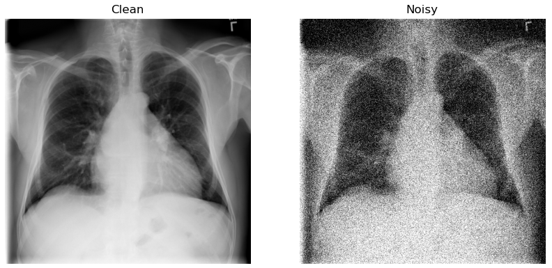

# TV-Autoencoder

This project investigates the benefit of using total variation convex optimization layers in medical image denoising.
Using a denoising 2D Unet architecture, variations of configurations are tested on the NIH ChestX-ray14 data set and evaluated for their reconstruction ability. 

### Denoising

 